# Resolvia

**IA privada para soporte TI que aprende de cómo resuelve problemas tu equipo.**

Mesa de ayuda completa para instituciones educativas y pymes: centraliza las solicitudes en tickets, las clasifica y sugiere soluciones con inteligencia artificial que puede correr **dentro de la propia institución**, sin que los datos salgan de ella.


---

## El problema

En las instituciones educativas y empresas pequeñas, el área de soporte TI recibe solicitudes por canales dispersos (correo, llamadas, mensajes), sin clasificación ni prioridad. Los técnicos repiten las mismas respuestas a problemas conocidos y el conocimiento queda en la cabeza de pocas personas, en documentos que nadie consulta o en el historial de una herramienta anterior.

Las soluciones con IA disponibles suelen enviar los tickets, con datos personales de estudiantes y empleados, a servicios externos. Para muchas instituciones eso choca con sus políticas de protección de datos, como las que se derivan de la Ley 1581 de 2012 en Colombia.

Resolvia nace de la experiencia práctica en soporte técnico en una sede universitaria, donde este problema se vive a diario.

## La solución

Resolvia centraliza las solicitudes en tickets y usa inteligencia artificial para:

- **Clasificar** cada ticket por categoría y prioridad, con las categorías propias de cada organización.
- **Sugerir respuestas al técnico** con *Retrieval-Augmented Generation (RAG)*: el modelo responde a partir de los manuales de la organización **y de cómo su equipo resolvió casos parecidos**, citando las fuentes en lugar de inventar.
- **Medir el servicio**: volumen, cumplimiento de SLA, precisión de la IA y utilidad de sus sugerencias.

El técnico siempre tiene la última palabra: **la IA sugiere, la persona decide.**

## Qué lo diferencia

- **IA privada.** El modelo puede correr en la infraestructura de la institución con Ollama o vLLM; también admite cualquier API compatible con OpenAI o Claude, si la organización lo prefiere.
- **Aprende de los tickets resueltos**, no solo de los manuales: cada caso cerrado mejora las sugerencias del siguiente.
- **Migrar sin perder el historial.** Importación desde CSV/Excel, GLPI, documentos PDF/Word y correo, con revisión previa antes de importar.
- **Ingreso por correo.** Los usuarios pueden seguir escribiendo al correo de soporte y cada mensaje se convierte en un ticket.
- **La IA sugiere, la persona decide.** La IA no ejecuta acciones, y sus salidas se validan antes de mostrarse.

## Funcionalidades

| Funcionalidad | Descripción | Fase |
|---|---|---|
| Organizaciones | Una por instalación on-premise o varias en la nube, aisladas entre sí | 1 |
| Autenticación y roles | JWT con roles de usuario, técnico y administrador | 1 |
| Gestión de tickets | Crear, asignar, comentar y cerrar, con historial de cambios | 1 |
| Categorías configurables | Cada organización define las suyas | 1 |
| Comentarios internos | Notas del equipo invisibles para el solicitante | 1 |
| SLA básico | Tiempos de respuesta y resolución por prioridad | 1 |
| Web para técnicos | Bandeja, filtros, detalle e historial | 2 |
| Ingreso por correo | Correos convertidos en tickets y respuestas en comentarios; notificaciones | 3 |
| Clasificación con IA | Categoría y prioridad sugeridas en segundo plano | 4 |
| Sugerencias con RAG | Respuesta sugerida con fuentes: documentos y tickets resueltos | 5 |
| Tickets similares | Casos resueltos parecidos al ticket actual | 5 |
| Tablero de métricas | Volumen, SLA, precisión de la IA y utilidad de las sugerencias | 5 |
| Importación multifuente | CSV/Excel, GLPI, documentos y correo, con revisión previa | 6 |
| Paquete on-premise | Instalador, respaldos y actualización sin internet | 7 |
| Nube multi-organización | Despliegue en AWS | 8 |
| App móvil | Crear y seguir tickets desde el celular | 9 |

El detalle de cada fase está en la [hoja de ruta](docs/roadmap.md).

## Arquitectura

```mermaid
flowchart LR
    subgraph Clientes
        W[Web React<br/>técnicos y admin]
        M[App Flutter<br/>usuarios]
        C[Correo<br/>IMAP]
    end

    subgraph Backend
        API[API REST<br/>NestJS]
        WK[Worker<br/>cola pg-boss]
        IMP[Importadores<br/>CSV, GLPI, documentos, correo]
    end

    subgraph Datos
        DB[(PostgreSQL<br/>+ pgvector<br/>+ cola)]
        FS[(Almacenamiento<br/>de documentos)]
    end

    subgraph Modelos
        OL[Modelo local<br/>Ollama, vLLM]
        EXT[API externa<br/>opcional]
    end

    W --> API
    M --> API
    C --> WK
    API --> DB
    API --> FS
    API -. encola .-> DB
    DB -. trabajos .-> WK
    WK --> IMP
    WK --> DB
    WK -->|dentro de la institución| OL
    WK -.->|si la organización lo elige| EXT
```



Las tareas lentas (clasificación, embeddings, sugerencias, importaciones y correo) las procesa un worker en segundo plano, así que crear un ticket responde de inmediato aunque el modelo tarde. Los proveedores de IA solo transportan mensajes; los prompts y la validación viven en el dominio. Ver [docs/arquitectura.md](docs/arquitectura.md) y las [decisiones técnicas](docs/decisiones/).

## Modos de despliegue

| | On-premise | Nube |
|---|---|---|
| Organizaciones | Una por instalación | Varias, aisladas entre sí |
| Dónde corre la IA | En los servidores de la institución | Local en la plataforma o un proveedor elegido por la organización |
| Quién opera | La institución (con soporte opcional) | El proveedor del servicio |
| Pensado para | Instituciones con políticas estrictas de datos | Organizaciones sin equipo para administrar servidores |

Los dos modos usan el mismo código; la diferencia es de configuración (ADR 0005).

## Stack tecnológico

| Capa | Tecnologías |
|---|---|
| Backend | NestJS 12 (ESM), TypeScript estricto, Prisma 7, Node.js 24 |
| Base de datos | PostgreSQL 16 con pgvector |
| Tareas en segundo plano | pg-boss (planeado, fase 3) |
| Frontend web | React 19, TypeScript, Vite |
| Móvil | Flutter, Dart |
| Inteligencia artificial | Ollama o cualquier API compatible con OpenAI, Claude; embeddings multilingües bge-m3; RAG; validación con zod (planeado, fase 4) |
| Pruebas y calidad | Vitest, Supertest, oxlint |
| Infraestructura | Docker, Docker Compose, GitHub Actions (CI), AWS (fase 8) |

## Estructura del repositorio

```
resolvia/
├── apps/
│   ├── api/          # Backend NestJS
│   ├── web/          # Frontend React
│   └── mobile/       # App Flutter (fase 9)
├── docs/
│   ├── arquitectura.md
│   ├── roadmap.md
│   ├── plan-diario.md
│   ├── modelo-datos.prisma
│   └── decisiones/   # Registros de decisiones de arquitectura (ADR)
├── scripts/
├── .github/workflows/ # Integración continua
└── docker-compose.yml
```

## Cómo ejecutarlo

> El proyecto está en desarrollo. Estas instrucciones se irán completando con cada módulo.

**Requisitos:** Docker y Docker Compose, Node.js 24 (ver `.nvmrc`), Flutter (solo para la app móvil).

```bash
# 1. Clonar el repositorio
git clone https://github.com/WokerJJ/resolvia.git
cd resolvia

# 2. Configurar variables de entorno
cp .env.example .env

# 3. Levantar la base de datos
docker compose up -d db

# 4. Instalar la API, aplicar las migraciones y arrancarla
cd apps/api
npm install
npx prisma migrate dev
npm run start:dev
# http://localhost:3000/api/health y http://localhost:3000/api/docs

# 5. (Opcional) Levantar el modelo local de IA
docker compose --profile ai up -d
docker compose exec ollama ollama pull llama3.2:3b
docker compose exec ollama ollama pull bge-m3
```

`llama3.2:3b` es un modelo liviano solo para desarrollo. Los embeddings usan `bge-m3`, multilingüe y de 1024 dimensiones (ADR 0008).

## Hoja de ruta

El desarrollo avanza por fases, cada una entregable por sí misma. El detalle está en [docs/roadmap.md](docs/roadmap.md) y el calendario día a día en [docs/plan-diario.md](docs/plan-diario.md).

0. **Validación:** entrevistas con jefes de TI y conjunto de evaluación (en paralelo)
1. **MVP backend:** organizaciones, autenticación, tickets, categorías, historial y SLA
2. **Web** para técnicos
3. **Correo** y notificaciones
4. **IA I:** clasificación asíncrona
5. **IA II:** RAG sobre documentos y tickets resueltos, y métricas
6. **Importación multifuente**
7. **Empaquetado on-premise**
8. **Nube multi-organización**
9. **App móvil**

## Autor

**Jhon Hucker Chalarca Ramírez**  
Estudiante de Tecnología en Gestión de Sistemas Informáticos · UNINTEP

[GitHub](https://github.com/WokerJJ) · [LinkedIn](https://linkedin.com/in/jhonhucker) · [Portafolio](https://wokerjj.github.io/portafolio)

## Licencia

Copyright © 2026 Jhon Hucker Chalarca Ramírez.

Resolvia se distribuye bajo la licencia **GNU Affero General Public License v3.0 (AGPL-3.0)**. Ver [LICENSE](LICENSE).

- Puedes usarlo, estudiarlo, modificarlo e instalarlo en tu organización.
- Si ofreces Resolvia, modificado, **como servicio a través de una red**, debes poner el código de tus modificaciones a disposición de sus usuarios.
- Hay una **licencia comercial** disponible para quien no pueda cumplir las condiciones de la AGPL; solicítala contactando al autor.

El porqué de esta elección está en el [ADR 0011](docs/decisiones/0011-licencia-agpl.md).

### Marca

El nombre **Resolvia** y su logo identifican a este proyecto y a su autor, y **no están cubiertos por la licencia AGPL-3.0**, que solo se aplica al código. Puedes usar, modificar y redistribuir el código según la licencia, pero una versión modificada o un servicio basado en ella debe usar **otro nombre** y no presentarse como el Resolvia oficial ni como respaldado por su autor. Mencionar que tu trabajo se basa en Resolvia, con un enlace a este repositorio, sí está permitido y es bienvenido.
