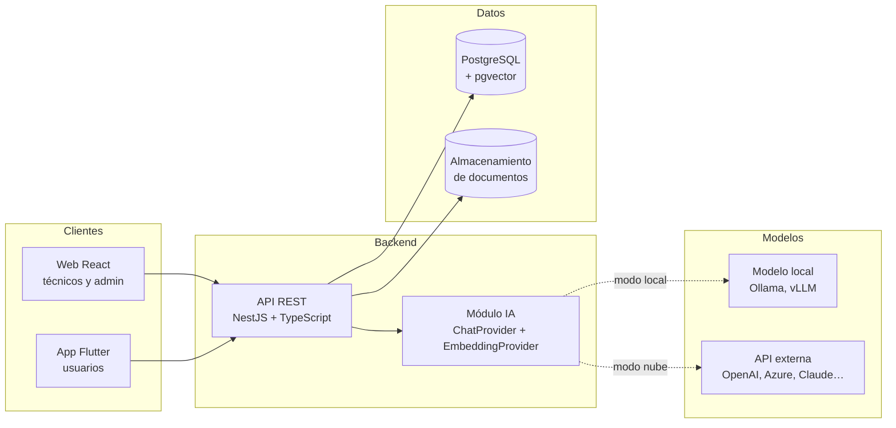

# Resolvia

**Mesa de ayuda inteligente que clasifica tickets de soporte y sugiere soluciones usando IA sobre la base de conocimiento de la organización.**


---

## El problema

En las instituciones educativas y empresas pequeñas, el área de soporte TI recibe solicitudes por canales dispersos (correo, llamadas, mensajes), sin clasificación ni prioridad. Los técnicos repiten las mismas respuestas a problemas conocidos y el conocimiento queda en la cabeza de pocas personas o en documentos que nadie consulta.

Resolvia nace de la experiencia práctica en soporte técnico en una sede universitaria, donde este problema se vive a diario.

## La solución

Resolvia centraliza las solicitudes en tickets y usa inteligencia artificial para:

- **Clasificar automáticamente** cada ticket por categoría (red, hardware, software, cuentas y accesos) y prioridad.
- **Sugerir respuestas al técnico** usando *Retrieval-Augmented Generation (RAG)*: el modelo responde a partir de los manuales y procedimientos propios de la organización, citando la fuente, en lugar de inventar.
- **Medir el servicio** con un tablero de métricas: volumen por categoría, tiempo de resolución y utilidad de las sugerencias de la IA.

El técnico siempre tiene la última palabra: la IA sugiere, la persona decide.

## Funcionalidades

| Módulo | Descripción | Estado |
|---|---|---|
| Autenticación y roles | JWT con roles de usuario, técnico y administrador | ⏳ Planeado |
| Gestión de tickets | Crear, asignar, comentar y cerrar tickets con historial | ⏳ Planeado |
| Clasificación con IA | Categoría y prioridad sugeridas con nivel de confianza | ⏳ Planeado |
| Base de conocimiento | Carga de documentos PDF indexados con embeddings vectoriales | ⏳ Planeado |
| Sugerencias con RAG | Respuesta sugerida con referencia a los documentos usados | ⏳ Planeado |
| Tablero de métricas | Indicadores de servicio para el equipo de soporte | ⏳ Planeado |
| App móvil | Creación y seguimiento de tickets desde el celular | ⏳ Planeado |

## Arquitectura



El módulo de IA no depende de ningún proveedor: el modelo de chat y el de embeddings se configuran por separado con variables de entorno. Un único adaptador compatible con la API de OpenAI permite usar OpenAI, Azure OpenAI, Gemini, Mistral o modelos propios servidos con Ollama o vLLM, y hay un adaptador para Claude. Así una organización puede usar el proveedor que ya tiene contratado, o mantener todos los datos dentro de su infraestructura, sin modificar la lógica de negocio. Ver [docs/arquitectura.md](docs/arquitectura.md) y las [decisiones técnicas](docs/decisiones/).

## Stack tecnológico

| Capa | Tecnologías |
|---|---|
| Backend | NestJS, TypeScript, Prisma ORM |
| Base de datos | PostgreSQL 16 con extensión pgvector |
| Frontend web | React, TypeScript, Vite |
| Móvil | Flutter, Dart |
| Inteligencia artificial | Cualquier API compatible con OpenAI (incluye Ollama local), Claude, embeddings con pgvector, RAG |
| Pruebas | Vitest, Supertest |
| Infraestructura | Docker, Docker Compose, GitHub Actions (CI/CD), AWS |

## Estructura del repositorio

```
resolvia/
├── apps/
│   ├── api/          # Backend NestJS
│   ├── web/          # Frontend React
│   └── mobile/       # App Flutter
├── docs/
│   ├── arquitectura.md
│   ├── roadmap.md
│   ├── modelo-datos.prisma
│   └── decisiones/   # Registros de decisiones de arquitectura (ADR)
├── scripts/
├── .github/workflows/ # Integración continua
└── docker-compose.yml
```

## Cómo ejecutarlo

> El proyecto está en su fase inicial. Estas instrucciones se irán completando con cada módulo.

**Requisitos:** Docker y Docker Compose, Node.js 24 (ver `.nvmrc`), Flutter (solo para la app móvil).

```bash
# 1. Clonar el repositorio
git clone https://github.com/WokerJJ/resolvia.git
cd resolvia

# 2. Configurar variables de entorno
cp .env.example .env

# 3. Levantar la base de datos
docker compose up -d db

# 4. (Opcional) Levantar el modelo local de IA
docker compose --profile ai up -d
docker compose exec ollama ollama pull llama3.2:3b
docker compose exec ollama ollama pull nomic-embed-text
```

## Hoja de ruta

El desarrollo avanza por fases, cada una entregable por sí misma. El detalle está en [docs/roadmap.md](docs/roadmap.md) y el calendario día a día en [docs/plan-diario.md](docs/plan-diario.md).

1. **MVP:** autenticación, tickets, pruebas e integración continua
2. **Web:** tablero para técnicos
3. **IA I:** clasificación automática de tickets
4. **IA II:** base de conocimiento y sugerencias con RAG
5. **Nube:** métricas y despliegue en AWS
6. **Móvil:** app Flutter para usuarios

## Autor

**Jhon Hucker Chalarca Ramírez**  
Estudiante de Tecnología en Gestión de Sistemas Informáticos · UNINTEP

[GitHub](https://github.com/WokerJJ) · [LinkedIn](https://linkedin.com/in/jhonhucker) · [Portafolio](https://wokerjj.github.io/portafolio)

## Licencia

Distribuido bajo la licencia MIT. Ver [LICENSE](LICENSE).
