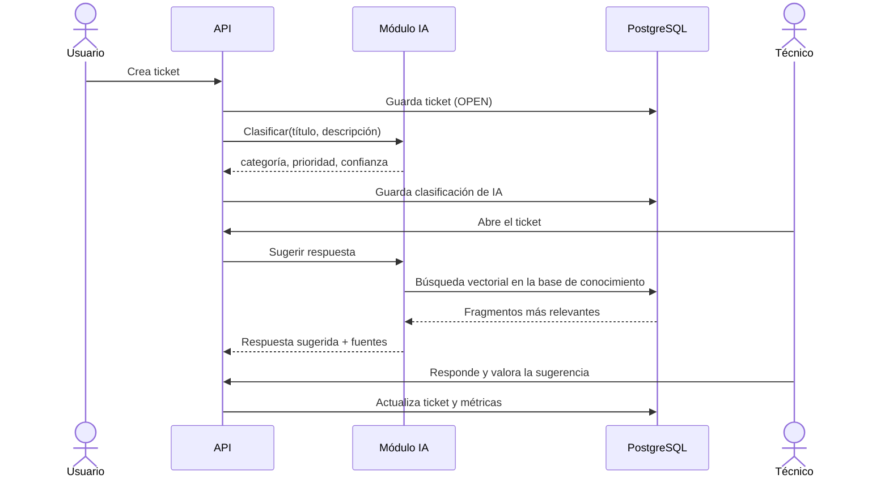

# Arquitectura de Resolvia

## Visión general

Resolvia es un monorepo con tres aplicaciones cliente-servidor que comparten una API REST:

- **apps/api** — Backend en NestJS. Es la única pieza que habla con la base de datos y con los modelos de IA.
- **apps/web** — Frontend en React para técnicos y administradores.
- **apps/mobile** — App en Flutter para que los usuarios creen y sigan sus tickets.

## Módulos del backend

| Módulo | Responsabilidad |
|---|---|
| `auth` | Registro, inicio de sesión, emisión de JWT y guards por rol |
| `users` | Gestión de usuarios y roles |
| `tickets` | Ciclo de vida de los tickets, asignación y comentarios |
| `ai` | Interfaz `LLMProvider`, clasificación y generación de sugerencias |
| `knowledge` | Carga de PDFs, división en fragmentos (*chunking*) y embeddings |
| `metrics` | Consultas agregadas para el tablero |

Cada módulo sigue la separación **Controller → Service → Repository (Prisma)**, de modo que la lógica de negocio no depende del framework HTTP ni del ORM.

## Flujo de un ticket

## Flujo RAG (base de conocimiento)

1. El administrador sube un PDF (manual, procedimiento, guía).
2. El texto se extrae y se divide en fragmentos de tamaño controlado, con solapamiento.
3. Cada fragmento se convierte en un vector (embedding) y se guarda en `DocumentChunk` con pgvector.
4. Al pedir una sugerencia, el ticket se convierte en vector y se buscan los fragmentos más similares.
5. Esos fragmentos se envían como contexto al modelo, que redacta la respuesta citando sus fuentes.

## Principios

- **La IA sugiere, la persona decide.** Ninguna acción de la IA se aplica sin revisión del técnico.
- **Proveedores intercambiables.** El dominio no conoce qué modelo se usa (ver ADR 0001).
- **Todo se levanta con Docker.** Un desarrollador nuevo debe poder correr el proyecto con pocos comandos.
- **Nada llega a `main` sin pasar la integración continua.**
