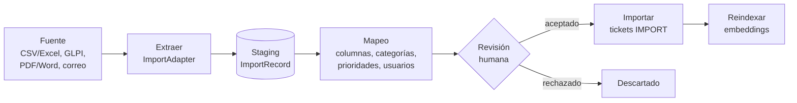

# Arquitectura de Resolvia

> Este documento mezcla lo que **ya existe** en el código con lo que está **planeado**. Las tablas y secciones lo indican con ✅ (implementado) y ⏳ (planeado, con la fase del [roadmap](roadmap.md)).

## Visión general

Resolvia es un monorepo con aplicaciones cliente que comparten una API REST, más un *worker* para las tareas en segundo plano:

- **apps/api** — Backend en NestJS. Es la única pieza que habla con la base de datos y con los modelos de IA. ✅
- **Worker** — Mismo código que la API, arrancado con otro punto de entrada; procesa la cola de trabajos (ADR 0007). ⏳ Fase 3
- **apps/web** — Frontend en React para técnicos y administradores. ⏳ Fase 2 (hoy solo el scaffold)
- **apps/mobile** — App en Flutter para que los usuarios creen y sigan sus tickets. ⏳ Fase 9

La misma base de código funciona en dos modos (ADR 0005): **on-premise**, con una sola organización por instalación, y **nube**, con varias organizaciones aisladas entre sí.

## Módulos del backend

| Módulo | Responsabilidad | Estado |
|---|---|---|
| `config` | Variables de entorno validadas al arrancar | ✅ |
| `prisma` | Cliente de Prisma 7 compartido (adaptador `pg`) con la extensión que filtra por organización | ✅ |
| `health` | `GET /api/health`: disponibilidad de la API y la base de datos | ✅ |
| `users` | Usuarios y roles; contraseñas cifradas con bcrypt | ✅ |
| `organizations` | Organizaciones y contexto de organización de cada petición (`OrganizationContext`) | ✅ |
| `auth` | Registro, login, JWT con `organizationId` y guards por rol | ⏳ Fase 1 |
| `categories` | Categorías configurables por organización | ⏳ Fase 1 |
| `tickets` | Ciclo de vida, asignación, comentarios públicos e internos, historial (`TicketEvent`) y SLA | ⏳ Fase 1 |
| `jobs` | Cola de trabajos con pg-boss y registro de los trabajos del worker | ⏳ Fase 3 |
| `email-intake` | Lectura del buzón (IMAP): crea tickets y agrega respuestas como comentarios | ⏳ Fase 3 |
| `ai` | Proveedores como transporte (ADR 0006), `TicketClassifierService` y `SuggestionService` | ⏳ Fases 4–5 |
| `knowledge` | Documentos, fragmentos y embeddings para RAG | ⏳ Fase 5 |
| `metrics` | Consultas agregadas para el tablero | ⏳ Fase 5 |
| `imports` | Importación multifuente con staging; adaptadores CSV/Excel, GLPI, documentos y correo (ADR 0009) | ⏳ Fase 6 |

Cada módulo sigue la separación **Controller → Service → Repository**: los servicios contienen la lógica y dependen de contratos (clases abstractas) que los repositorios implementan con Prisma. Así la lógica de negocio no depende del framework HTTP ni del ORM, y se prueba con repositorios simulados.

## Worker y procesamiento asíncrono

Las tareas lentas o que dependen de servicios externos no se ejecutan dentro de la petición HTTP (ADR 0007). La API encola un trabajo en **pg-boss**, que guarda la cola en la misma PostgreSQL, y el worker lo procesa:

| Trabajo | Lo encola |
|---|---|
| Clasificar un ticket | Creación del ticket |
| Generar embeddings de un ticket o documento | Ticket resuelto, documento cargado, importación, reindexación |
| Preparar una sugerencia | El técnico la pide |
| Extraer e importar registros | Una importación |
| Leer el buzón de correo | Tarea periódica |
| Enviar notificaciones | Cambios en un ticket |

Los trabajos son idempotentes y tienen reintentos: procesarlos dos veces no duplica resultados.

## Flujo de un ticket

La creación responde de inmediato; la clasificación llega después, desde el worker.

```mermaid
sequenceDiagram
    actor U as Usuario
    participant API
    participant Q as Cola (pg-boss)
    participant W as Worker
    participant AI as Proveedor de IA
    participant DB as PostgreSQL
    actor T as Técnico

    U->>API: Crea ticket (web, correo o móvil)
    API->>DB: Guarda ticket (OPEN) y evento CREATED
    API->>Q: Encola "clasificar ticket"
    API-->>U: 201 Creado (sin esperar a la IA)
    Q->>W: Entrega el trabajo
    W->>AI: Prompt versionado + ticket delimitado como dato
    AI-->>W: JSON con categoría y prioridad
    W->>W: Valida con zod (un reintento; si falla, sin clasificar)
    W->>DB: Guarda la sugerencia y el evento AI_CLASSIFIED
    T->>API: Abre el ticket, acepta o corrige la categoría
    API->>DB: Guarda la decisión (CATEGORY_CHANGED si la corrige)
    T->>API: Pide una sugerencia de respuesta
    API->>Q: Encola "preparar sugerencia"
    W->>DB: Búsqueda vectorial en documentos y tickets resueltos
    W->>AI: Prompt con los fragmentos como contexto
    AI-->>W: Respuesta sugerida con fuentes
    W->>DB: Guarda la sugerencia
    T->>API: Responde al usuario y valora la sugerencia
```

## Flujo RAG

1. El administrador sube un documento (manual, procedimiento, guía) a la base de conocimiento.
2. El texto se extrae y se divide en fragmentos de tamaño controlado, con solapamiento.
3. Cada fragmento, y cada ticket resuelto, se convierte en un vector con **bge-m3** (ADR 0008) y se guarda con pgvector, junto con el modelo que lo generó.
4. Al pedir una sugerencia, el ticket se convierte en vector y se buscan los fragmentos y tickets resueltos más similares **de la misma organización**.
5. Ese contexto se envía al modelo, delimitado como dato, y el modelo redacta la respuesta citando sus fuentes.

## Flujo de importación



Cada fuente implementa la misma interfaz y produce un `NormalizedTicket`; el resto del flujo es común (ADR 0009). La extracción desde documentos y correo usa el LLM y su revisión es obligatoria.

## Principios

- **La IA sugiere, la persona decide.** Ninguna acción de la IA se aplica sin revisión del técnico; la IA no ejecuta acciones.
- **El contenido externo es dato, nunca instrucción.** El texto de los tickets, los correos y el contenido importado o recuperado se envían al modelo delimitados como datos (ADR 0010).
- **Toda salida del modelo se valida con un esquema** antes de guardarse; lo que no cumple se descarta.
- **Proveedores intercambiables.** El dominio no conoce qué modelo se usa; los proveedores solo transportan (ADR 0004 y 0006). El modelo puede correr dentro de la organización, sin que los datos salgan.
- **Aislamiento entre organizaciones.** El filtro por organización se aplica de forma centralizada, no a mano en cada consulta (ADR 0005).
- **Nada lento dentro de la petición.** Lo que depende del modelo o de servicios externos va a la cola (ADR 0007).
- **Todo se levanta con Docker.** Un desarrollador nuevo debe poder correr el proyecto con pocos comandos, y los servicios internos no se exponen fuera de la máquina.
- **Nada llega a `main` sin pasar la integración continua.**
